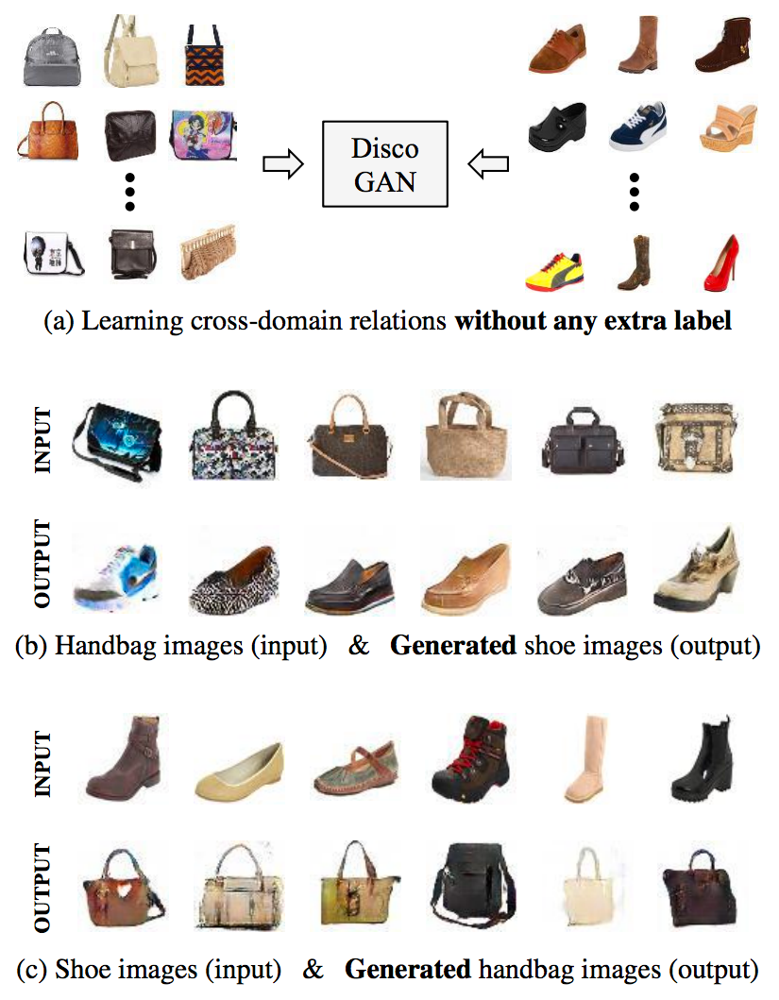
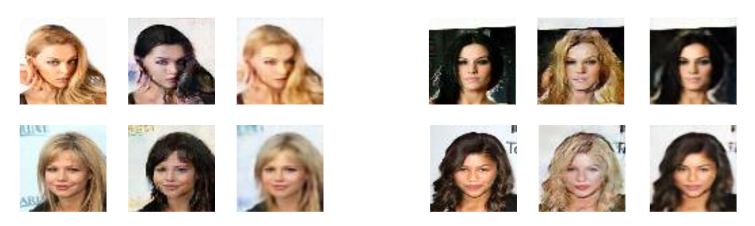
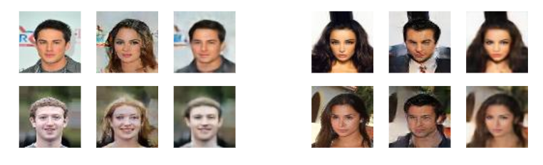
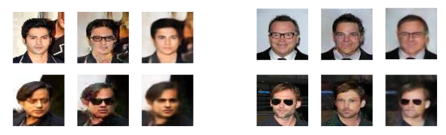
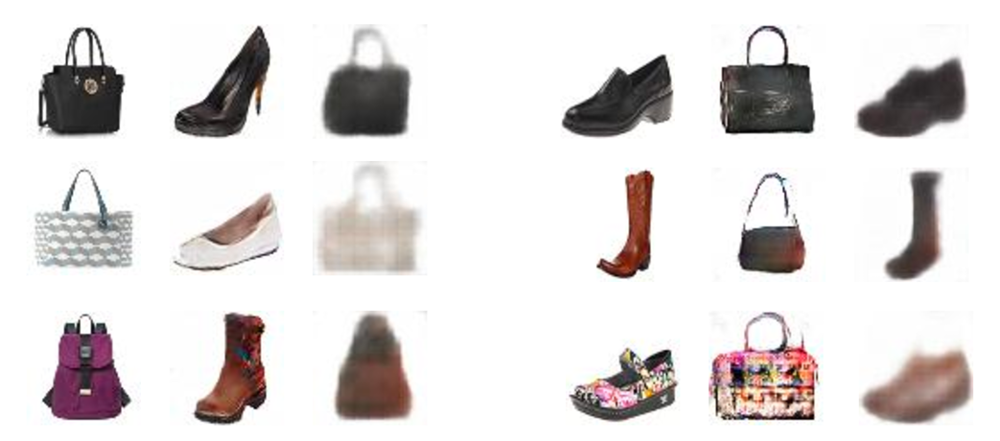
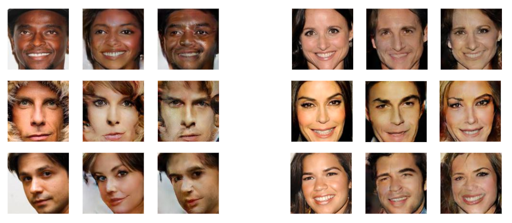
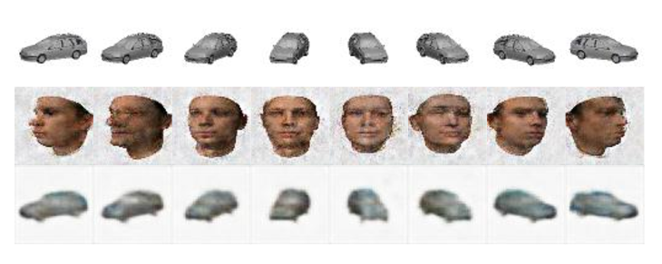

DiscoGAN
=========================================

Official PyTorch implementation of [Learning to Discover Cross-Domain Relations
with Generative Adversarial Networks](https://arxiv.org/pdf/1703.05192.pdf). 

Prerequisites
-------------
   - Python 2.7
   - PyTorch
   - Numpy/Scipy/Pandas
   - Progressbar
   - OpenCV

Training DiscoGAN
----------------
### CelebA
<del>Download CelebA dataset using</del>

  <del> python ./datasets/download.py celebA </del>

Currently, the link for downloading CelebA dataset is not available.

To train gender conversion,

    $ python ./discogan/image_translation.py --task_name='celebA' --style_A='Male'

To train hair color conversion 

    $ python ./discogan/image_translation.py --task_name='celebA' --style_A='Blond_Hair' --style_B='Black_Hair' --constraint='Male'

### Handbags / Shoes
Download Edges2Handbags dataset using 

    $ python ./datasets/download.py edges2handbags

Download Edges2Shoes dataset using 

    $ python ./datasets/download.py edges2shoes

To train Edges2Handbags,

    $ python ./discogan/image_translation.py --task_name='edges2handbags'

To train Edges2Shoes,

    $ python ./discogan/image_translation.py --task_name='edges2shoes' 

To train Handbags2Shoes,

    $ python ./discogan/image_translation.py --task_name='Handbags2Shoes' --starting_rate=0.5

### Facescrub
Download Edges2Handbags dataset using 

    $ python ./datasets/download.py facescrub

To train gender conversion,

    $ python ./discogan/image_translation.py --task_name='facescrub'

### Car, Face
Download [3D car dataset](http://www.scottreed.info/files/nips2015-analogy-data.tar.gz) used in [Deep Visual Analogy-Making]( http://www-personal.umich.edu/~reedscot/nips2015.pdf), and [3D face dataset](http://faces.cs.unibas.ch/bfm/main.php?nav=1-2&id=downloads), and extract them in data folder

To train Car2Car translation,

    $ python ./discogan/angle_pairing.py --task_name='car2car' 

To train Car2Face translation,

    $ python ./discogan/angle_pairing.py --task_name='car2face'

Results
=============
All example results show x_A, x_AB, x_ABA and x_B, x_BA, x_BAB

Example results of hair color conversion

Example results of gender conversion (CelebA)

Example results of wearing/taking off eyeglasses

Example results of Edges2Handbags 

Example results of Handbags2Shoes 

Example results of gender conversion (Facescrub)

Example results of car2face conversion 

